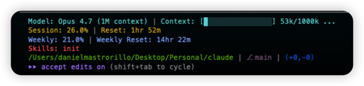

# claude

My personal collection of [Claude Code](https://claude.ai/code) customisations — slash commands, subagents, and skills I've written or curated — plus a record of third-party skills I want to keep across machines.

Everything here is plain Markdown (with YAML frontmatter where needed) or JSON. Nothing builds or runs; files are copied/symlinked into `~/.claude/` or a project's `.claude/` to take effect.

## What's in here

| Path | What it is |
| --- | --- |
| `commands/` | Custom slash commands. Filename (minus `.md`) becomes the command name (`commands/spar.md` → `/spar`). Body is the prompt; `$ARGUMENTS` is the user-input placeholder. |
| `agents/` | Subagent definitions. Frontmatter: `name`, `description`, `tools`, `model`. |
| `skills/` | Custom skills, one folder per skill, each with a `SKILL.md`. The `description` in the frontmatter is the trigger surface — be specific about *when* to invoke. |
| `skills-lock.json` | Lockfile for the [`skills`](https://www.npmjs.com/package/skills) npm package. Records third-party skills to re-install on a new machine. New entries must match the existing shape exactly. |

## Other tools I pair with Claude Code

Things that aren't Markdown and so can't live in this repo, but are part of how I work:

- **[OpenSpec](https://openspec.dev/)** — spec-driven workflow for AI coding agents. Keeps a living spec the agent works against instead of drifting prompt-to-prompt.
- **[ccstatusline](https://github.com/sirmalloc/ccstatusline)** — customisable status line for Claude Code (model, token usage, git context, etc.). My setup:

  
